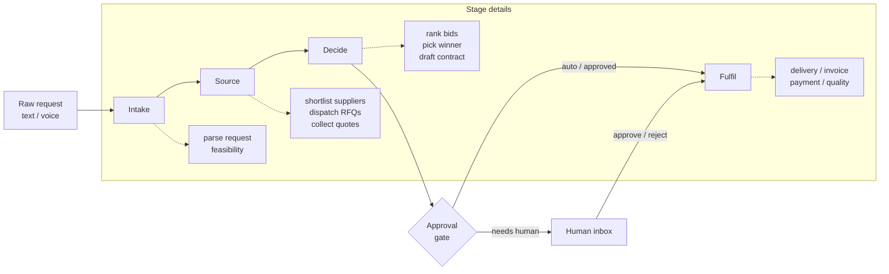

# Mastering Agentic Workflow Systems — A Hands-On Guide (using Procura)

> **Who this is for:** an engineer who wants to *truly understand* multi-agent
> orchestration systems — not just glue an LLM to an API — and walk into an AI
> Engineering interview able to defend every design decision.
>
> **How to use it:** read top-to-bottom once for the mental model, then keep it
> open beside the code and follow the "Trace a request end-to-end" section with
> a debugger attached. Every claim here maps to a real file in this repo.

---

## 0. The one-paragraph mental model

An **agentic workflow system** is a pipeline of small, single-purpose units
("agents") that pass a **shared, typed state object** between them. Some units
*reason* (call an LLM over ambiguous input); most units are *deterministic*
(plain functions doing math, lookups, routing). A **router/orchestrator**
decides what runs next, an **approval gate** inserts a human, and an **audit
log** records who did what. The art is in the *boundaries*: keep money math out
of the LLM, keep free-form text out of your settlement logic, and make the state
the single source of truth. That is exactly what Procura implements.

---

## 1. Why this architecture (and what interviewers probe)

Most "AI agent" demos are a single prompt that does everything. They fall apart
in production because:

| Naive demo | Production reality | How Procura answers it |
| --- | --- | --- |
| One mega-prompt does parsing + math + decisions | LLMs are unreliable at arithmetic and non-deterministic | **LLM only at the edges** — see [ADR 0003](decisions/0003-llm-only-at-the-edges.md) |
| State lives in prompt strings | You need to query, audit, and resume state | A **typed Pydantic state model** ([packages/core/models/order.py](../packages/core/models/order.py)) |
| Supplier APIs called directly | Every vendor has a different format | **Adapter / anti-corruption layer** ([ADR 0004](decisions/0004-adapter-anti-corruption-layer.md)) |
| No human in the loop | Real money needs governance | An explicit **approval gate** with thresholds |
| "It worked on my laptop" | Demos must run with zero credentials | A **deterministic demo mode** that needs no API keys |

> **Interview soundbite:** *"I keep the LLM at the edges — parsing and
> explanation — and make every financial and routing decision a pure, testable
> function. That gives me determinism where it matters and flexibility where it
> doesn't."*

---

## 2. The big picture



Every box mutates **one shared object** (`ProcurementOrder`) and appends to its
`audit_log`. Nothing invents a new data shape mid-flight — that is the
load-bearing rule of the whole system.

---

## 3. The shared state model — the spine of the system

Open [packages/core/models/order.py](../packages/core/models/order.py). The
entire workflow revolves around one aggregate:

```text
ProcurementOrder
├── identity        (order_id, tenant_id, thread_id, timestamps)
├── request         (raw_input, material_code, quantity, region, parse_confidence)
├── intake          (feasibility_score, budget_ok, budget_remaining, schedule_ok)
├── sourcing        (candidate_supplier_ids, sourcing_rationale)
├── bidding         (rfqs_sent[], quotes_received[], comparison_matrix, recommended_bid)
├── contract        (template_id, terms, sign_status)
├── approval        (required_level, status, approver_id, decision_reason)
├── fulfilment      (delivery_events[], invoice, payment, quality)
├── audit_log[]     (who did what, when, and why)
└── pipeline_control(active_agent, completed_agents[], status)
```

**Why this matters (and why interviewers love it):**

1. **Single source of truth.** Each stage reads what previous stages wrote.
   There is no hidden state in closures or prompt history.
2. **Typed and validated.** Pydantic rejects malformed data at the boundary
   (`quantity > 0`, `0 <= reliability_score <= 1`). Bad data fails *loudly and
   early*, not three stages later.
3. **Auditable.** `audit_log` is an append-only trail — exactly what you need
   for compliance, debugging, and "explain this decision" requests.
4. **Resumable.** Because state is a serializable object with a `thread_id`, you
   could persist it and resume after the human approval gate. (Procura stores it
   in memory in [apps/api/store.py](../apps/api/store.py); swapping that for
   Postgres changes nothing upstream.)

> **Key concept — "state machine, not a chat log."** Agentic systems that store
> state as conversation history cannot be queried, audited, or resumed. A typed
> state object can.

---

## 4. What an "agent" actually is here

Forget the sci-fi. In this codebase an **agent is just a function** with one
responsibility that takes the order, mutates one slice of it, and returns it.
See [docs/agents.md](agents.md):

> *Each agent owns one narrow responsibility and either reasons over ambiguous
> inputs with an LLM, **or** calls deterministic tools and writes validated
> state. No agent combines both financial arithmetic and free-form reasoning in
> the same code path.*

Two flavours:

### 4a. Deterministic nodes (the majority)
Plain Python. Example — ranking bids in
[packages/agents/decide/bid_comparison.py](../packages/agents/decide/bid_comparison.py):

```python
def rank_bids(order):
    quotes = rank_quotes_by_total(order.bidding.quotes_received)
    order.bidding.comparison_matrix = {
        "quote_count": len(quotes),
        "lowest_total": quotes[0].total if quotes else None,
    }
    return order
```

No LLM. Fully testable. Same input → same output, every time.

### 4b. Reasoning nodes (the edges)
LLM-backed, in [packages/agents/llm_nodes.py](../packages/agents/llm_nodes.py).
They do exactly four things — the only places ambiguity or prose belongs:

| Node | Job | Why an LLM |
| --- | --- | --- |
| `parse_site_request` | Turn `"Need 500 tons of rebar in Sydney"` into structured fields | Natural-language extraction |
| `assess_feasibility` | Score + explain supply risk | Judgement over fuzzy context |
| `explain_recommendation` | Explain *why* the winning bid won | Prose, grounded on real numbers |
| `write_contract_cover` | Draft a contract cover note | Text generation |

Notice what these nodes **never** do: pick the winner, compute totals, or decide
the approval level. Those are deterministic. That separation is the entire point
of [ADR 0003](decisions/0003-llm-only-at-the-edges.md).

---

## 5. The five stages, in order

| Stage | Files | Reads | Writes |
| --- | --- | --- | --- |
| **Intake** | `intake/feasibility.py`, `llm_nodes.parse_site_request` | `request.raw_input` | `request.*`, `intake.*` |
| **Source** | `source/vendor_sourcing.py`, `source/rfq_manager.py` | material/region | `sourcing.*`, `bidding.rfqs_sent` |
| **Decide** | `decide/bid_comparison.py`, `decide/awarding.py`, `decide/contracts.py` | `bidding.quotes_received` | `bidding.comparison_matrix`, `recommended_bid`, `contract.*` |
| **Approve** | `approve/approvals.py`, `router.determine_approval_level` | `recommended_bid.total` | `approval.*`, `pipeline_control.status` |
| **Fulfil** | `fulfill/tracking.py` (others stubbed) | order status | `fulfilment.*` |

### The approval gate — the most "interview-able" piece
[packages/agents/router.py](../packages/agents/router.py) is a pure function
that converts a number into a governance decision:

```python
def determine_approval_level(order):
    total = float(order.bidding.recommended_bid.get("total", 0.0))
    if total > 500_000:  return ApprovalLevel.DIRECTOR
    if total >= 50_000:  return ApprovalLevel.PROJECT_MANAGER
    return ApprovalLevel.AUTO
```

- Under \$50k → auto-approved, pipeline `COMPLETED`.
- \$50k–\$500k → routed to a Project Manager, pipeline `AWAITING_HUMAN`.
- Over \$500k → routed to a Director.

When a human acts, [apps/api/routes/approvals.py](../apps/api/routes/approvals.py)
flips `approval.status` and `pipeline_control.status` and appends an audit entry.

> **Interview soundbite:** *"The human-in-the-loop gate is a deterministic
> threshold function, not an LLM judgement. You never want a model deciding
> whether a \$2M purchase needs director sign-off."*

---

## 6. The three execution modes — the config system

This is the feature that makes the repo both a *demo* and a *real* system. One
environment variable, `LLM_MODE`, selects the entire pipeline's behaviour.

### 6a. Where it lives
[packages/llm/config.py](../packages/llm/config.py) — a `pydantic-settings`
class that loads from `.env` or the environment:

```python
class LLMSettings(BaseSettings):
    llm_mode: Literal["demo", "azure", "llama"] = "demo"
    azure_openai_endpoint: str | None = None
    azure_openai_api_key: str | None = None
    azure_openai_deployment: str = "gpt-4o-mini"
    llama_base_url: str = "http://localhost:11434/v1"
    llama_model: str = "llama3.1"
    ...
```

### 6b. How a mode is chosen at runtime
[packages/agents/pipeline.py](../packages/agents/pipeline.py) exposes a single
dispatcher:

```python
def run_pipeline(*, raw_input, material_code, quantity, region, tenant_id="demo"):
    settings = get_llm_settings()
    if settings.llm_mode == "demo":
        return run_demo_pipeline(...)        # no LLM, no deps, no creds
    llm = get_llm_client(settings)           # builds Azure or Llama client
    if llm is None:
        return run_demo_pipeline(...)        # defensive fallback
    return run_llm_pipeline(llm=llm, ...)    # real reasoning at the edges
```

The API route ([apps/api/routes/orders.py](../apps/api/routes/orders.py)) just
calls `run_pipeline(...)` — it doesn't know or care which mode is active.

### 6c. The client factory
[packages/llm/client.py](../packages/llm/client.py) hides both providers behind
one `LLMClient` wrapper, because **both Azure OpenAI and Ollama speak the OpenAI
chat API**:

```python
def get_llm_client(settings):
    if settings.llm_mode == "demo":
        return None
    if settings.llm_mode == "azure":
        from openai import AzureOpenAI       # imported lazily!
        ...
    if settings.llm_mode == "llama":
        from openai import OpenAI            # points at localhost:11434/v1
        ...
```

**Why lazy imports?** So the demo path never needs the `openai` package
installed. That keeps the hosted Render demo dependency-free. `openai` lives in a
separate [requirements-llm.txt](../requirements-llm.txt) you only install for
real modes.

### 6d. The three modes at a glance

| `LLM_MODE` | What runs | Credentials | Extra deps | Use case |
| --- | --- | --- | --- | --- |
| `demo` (default) | Deterministic pipeline; quotes from a price table | none | none | Render demo, tests, offline dev |
| `azure` | Real Azure OpenAI at the edges | `AZURE_OPENAI_*` | `requirements-llm.txt` | Production / cloud eval |
| `llama` | Local OpenAI-compatible server (Ollama/llama.cpp) | none | `requirements-llm.txt` | Private/local eval, model comparison |

> **Design pattern name:** this is the **Strategy pattern** selected by config,
> combined with a **null-object** (`demo` = "no LLM"). The deterministic core
> (pricing, ranking, budget, approval) is *identical* across all three modes, so
> when you compare Azure vs Llama you are comparing *only the reasoning*, not the
> arithmetic. That is what makes it a fair model-comparison harness.

---

## 7. The adapter / anti-corruption layer (the supplier side)

Real procurement integrates with vendors over REST, SOAP, GraphQL, SFTP batch
files, EDI webhooks, and fixed-width mainframe records. If you let those formats
leak into your pipeline, every supplier change breaks your core.

Procura's answer ([ADR 0004](decisions/0004-adapter-anti-corruption-layer.md)):
the pipeline **only** consumes canonical `RFQ` and `QuoteRecord` models. Each
supplier gets an adapter ([packages/adapters/](../packages/adapters/)) that
translates vendor-native payloads into the canonical shape. The mock supplier
services live in [apps/suppliers/](../apps/suppliers/) — one per channel:

```
apps/suppliers/
├── rest_harboursteelworks/   REST/JSON   (the only fully-built one)
├── soap_bluerangecement/     SOAP/XML    (stub)
├── graphql_buildnorth/       GraphQL     (stub)
├── sftp_baycourier/          batch drop  (stub)
├── edi_pacifictiles/         EDI webhook (stub)
└── mainframe_sydneymills/    fixed-width (stub)
```

> **Interview soundbite:** *"I wrap every external system in an adapter so my
> domain model never depends on a vendor's wire format. That's an
> anti-corruption layer — when a supplier changes their API, the blast radius is
> one adapter, not the whole pipeline."*

---

## 8. Running it

### 8a. Demo mode (zero setup)
```bash
python3 -m venv .venv
. .venv/bin/activate
pip install --upgrade pip
pip install -r requirements-dev.txt
make test                      # 10 tests should pass

uvicorn apps.api.main:app --reload
```
- Dashboard: <http://localhost:8000/>
- API docs:  <http://localhost:8000/docs>
- Mode check: `curl localhost:8000/health/ready` → `{"status":"ready","llm_mode":"demo"}`

Create an order:
```bash
curl -X POST localhost:8000/orders \
  -H 'content-type: application/json' \
  -d '{"raw_input":"Need 500 tons of rebar steel in Sydney","material_code":"rebar_steel","quantity":500,"region":"sydney"}'
```

### 8b. Local Llama mode
```bash
pip install -r requirements-llm.txt
ollama serve            # in one terminal
ollama pull llama3.1    # once

# .env
LLM_MODE=llama
LLAMA_BASE_URL=http://localhost:11434/v1
LLAMA_MODEL=llama3.1

uvicorn apps.api.main:app --reload
# now /health/ready reports "llm_mode":"llama" and parsing/explanations are real
```

### 8c. Azure mode
```bash
pip install -r requirements-llm.txt

# .env
LLM_MODE=azure
AZURE_OPENAI_ENDPOINT=https://your-resource.openai.azure.com
AZURE_OPENAI_API_KEY=...           # never commit this; .env is gitignored
AZURE_OPENAI_DEPLOYMENT=gpt-4o-mini
AZURE_OPENAI_API_VERSION=2024-10-21
```

> **Security note:** `.env` is in `.gitignore`. Keep real keys there or in your
> shell environment — never in code or `.env.example`.

---

## 9. Debugging guide

| Symptom | Likely cause | Where to look |
| --- | --- | --- |
| `/health/ready` shows `demo` when you wanted `azure` | `.env` not loaded / `LLM_MODE` unset | [config.py](../packages/llm/config.py); `get_llm_settings()` is `@lru_cache`d — restart the process after editing `.env` |
| `LLMConfigurationError: azure mode requires…` | Missing endpoint/key | `.env` Azure block |
| `ModuleNotFoundError: openai` | Real mode without optional deps | `pip install -r requirements-llm.txt` |
| Connection refused on llama | Ollama not running / wrong port | `ollama serve`; check `LLAMA_BASE_URL` |
| Model returns prose instead of JSON | Server ignores `response_format` | `_loads_json` in [client.py](../packages/llm/client.py) extracts the `{...}` substring as a fallback; upgrade Ollama for native JSON mode |
| Wrong material/quantity parsed | LLM extraction missed | `parse_site_request` falls back to the request's own fields — check `parse_confidence` in the response |

### Attach a debugger
Set a breakpoint in `run_llm_pipeline` (or `run_demo_pipeline`) and POST an
order. Step through stage by stage — because all state is one object, you can
inspect `order` at any breakpoint and see the *entire* world.

### Caching gotcha (very common interview "trap")
`get_settings()` and `get_llm_settings()` use `@lru_cache(maxsize=1)`. They read
`.env` **once per process**. If you change `.env` and nothing happens — restart
the server. This is a deliberate trade (fast, consistent config) but bites people.

---

## 10. Trace a request end-to-end (do this with a debugger)

`POST /orders` with `LLM_MODE=demo`:

1. **[apps/api/routes/orders.py](../apps/api/routes/orders.py)** `create_order`
   validates the body with `CreateOrderRequest` (Pydantic) and calls
   `run_pipeline(...)`.
2. **[pipeline.py](../packages/agents/pipeline.py)** `run_pipeline` reads
   `LLM_MODE=demo` → calls `run_demo_pipeline`.
3. **Intake:** builds a `ProcurementOrder`, seeds feasibility, audits
   `site_request` and `feasibility`.
4. **Source:** `shortlist_suppliers` + `queue_rfqs` over the 6 `DEMO_SUPPLIERS`;
   `_collect_quotes` generates one `QuoteRecord` per supplier from `_BASE_PRICES`
   × markup.
5. **Decide:** `rank_bids` → `choose_lowest_bid` → `draft_contract`; computes
   `budget_remaining`.
6. **Approve:** `_finalize_approval` → `determine_approval_level` picks AUTO / PM
   / DIRECTOR by total; sets `pipeline_control.status`.
7. **[store.py](../apps/api/store.py)** `save_order` keeps it in the in-memory
   dict; the JSON order is returned.

Now flip to `LLM_MODE=llama` and trace again: steps 3 and the explanation in 5
now route through [llm_nodes.py](../packages/agents/llm_nodes.py) → `LLMClient`
→ your local model. **Everything else is byte-for-byte identical.** Seeing that
diff is the single most instructive thing in this repo.

---

## 11. Design decisions you should be able to defend

These mirror the repo's [ADRs](decisions/):

1. **LangGraph over CrewAI** ([0001](decisions/0001-langgraph-over-crewai.md)) —
   explicit graphs/state over opaque agent autonomy. *Procura currently wires the
   stages directly in `pipeline.py`; `graph.py` is the seam where a LangGraph
   `StateGraph` would slot in.*
2. **pgvector over ChromaDB** ([0002](decisions/0002-pgvector-over-chromadb.md)) —
   keep retrieval in the same Postgres you already operate.
3. **LLM only at the edges** ([0003](decisions/0003-llm-only-at-the-edges.md)) —
   the spine of this whole guide.
4. **Adapter anti-corruption layer** ([0004](decisions/0004-adapter-anti-corruption-layer.md)) —
   isolate vendor formats.

> **What's real vs. stubbed (be honest in interviews):** the intake → source →
> decide → approve flow runs end-to-end with real state, audit, and approval
> routing. The `fulfil` sub-stages, voice intake, streaming, LangGraph wiring,
> and five of six supplier services are intentional stubs marked
> `"...lands here in the next phase."` Knowing the boundary of your own system is
> a senior trait.

---

## 12. Interview question bank (with the answers this repo gives)

**Q: How do you stop an LLM from hallucinating a price?**
A: I never let it produce prices. Quotes come from deterministic functions; the
LLM only *explains* the already-chosen winner, grounded on real numbers in the
prompt (`explain_recommendation`).

**Q: How would you make this resumable across a human approval that takes days?**
A: State is a serializable Pydantic object with a `thread_id`. Persist it (swap
the in-memory `store.py` for Postgres), and re-enter the pipeline at the approval
stage when the human acts. No conversation replay needed.

**Q: How do you test a system that calls an LLM?**
A: Push the LLM to the edges and keep the core deterministic, so the core is unit
tested with fixed inputs (see [tests/](../tests/)). The reasoning nodes are
isolated behind `LLMClient`, so they can be mocked or run against a local model.

**Q: How do you compare two models fairly?**
A: `LLM_MODE=azure` vs `LLM_MODE=llama` over the same deterministic core means
the only variable is the model's reasoning/parsing. Pair it with the eval
harness in [evals/promptfoo/](../evals/promptfoo/).

**Q: A supplier changes their API overnight. What breaks?**
A: One adapter. The canonical `QuoteRecord`/`RFQ` models and the entire pipeline
are unaffected — that's the anti-corruption layer.

**Q: Why not one big agent with tools?**
A: Determinism, testability, auditability, and blast radius. Narrow single-
responsibility nodes with a typed shared state are debuggable and governable; a
mega-agent is neither.

---

## 13. Exercises to cement mastery

1. **Add a node.** Implement `intake/scheduling.py` to set
   `intake.required_delivery_window`, wire it into both pipelines, and add an
   audit entry. Confirm tests still pass.
2. **Add a deterministic guardrail.** Use `detect_price_outlier`
   ([pricing_tools.py](../packages/tools/pricing_tools.py)) in `rank_bids` to
   flag suspicious quote spreads in `comparison_matrix`.
3. **Add a fourth mode.** Add `openai` (public API) to `LLMSettings`,
   `get_llm_client`, and the `.env.example`. Notice how little else changes —
   that's the payoff of the Strategy pattern.
4. **Persist state.** Replace the in-memory dict in `store.py` with SQLite and
   prove an order survives a server restart.
5. **Wire the real graph.** Turn `graph.py`'s placeholder into an actual
   `StateGraph` whose nodes are the existing functions. The functions don't
   change — only the orchestration does.

---

## 14. File map (quick reference)

| Concern | File |
| --- | --- |
| Mode selector / settings | [packages/llm/config.py](../packages/llm/config.py) |
| Provider clients (Azure/Llama) | [packages/llm/client.py](../packages/llm/client.py) |
| LLM edge nodes | [packages/agents/llm_nodes.py](../packages/agents/llm_nodes.py) |
| Pipelines + dispatcher | [packages/agents/pipeline.py](../packages/agents/pipeline.py) |
| Approval routing | [packages/agents/router.py](../packages/agents/router.py) |
| Shared state model | [packages/core/models/order.py](../packages/core/models/order.py) |
| Deterministic tools | [packages/tools/pricing_tools.py](../packages/tools/pricing_tools.py) |
| Order API | [apps/api/routes/orders.py](../apps/api/routes/orders.py) |
| Approval API | [apps/api/routes/approvals.py](../apps/api/routes/approvals.py) |
| Health + active mode | [apps/api/routes/health.py](../apps/api/routes/health.py) |
| In-memory store | [apps/api/store.py](../apps/api/store.py) |
| Supplier mocks | [apps/suppliers/](../apps/suppliers/) |
| Design records | [docs/decisions/](decisions/) |

---

*Read the code with this guide open. The moment you can run the same request in
`demo` and `llama` mode and articulate exactly which lines diverge, you
understand agentic workflow systems better than most candidates in the room.*
